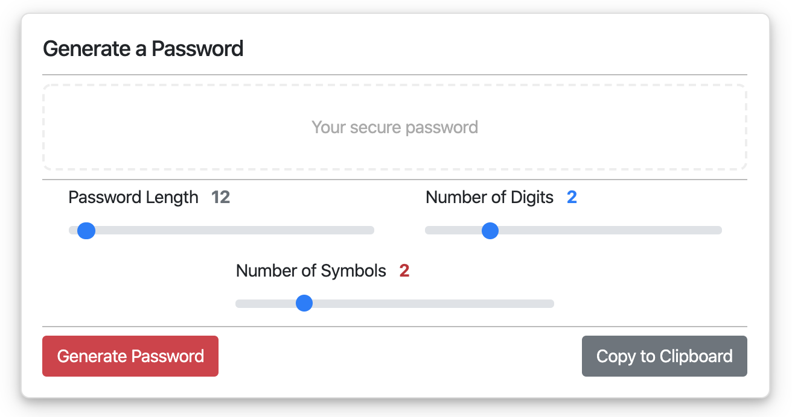

# Password Generator

## Description
This is a simple bootstrap app for generating passwords. We use passwords everyday for practically everything on the web, but unless you're a robot, coming up with one that's inherently secure is pretty much impossible. This app is for coming up with a cheap, secure password, quickly. 

## How to Play
* Visit the [site](https://millernj.github.io/password-generator/) and try it out! 
*  Use the sliders to determine the password length (between 8 and 128 characters), digit count, and symbol count for your desired password. 
* Click the "Generate Password" button to refresh the password with the current settings
* Use the "Copy to Clipboard" button to copy your password to your clipboard
* Try it on mobile!